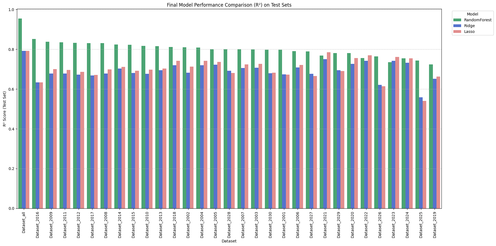

# Predicting HPLC retention time across variable chromatographic conditions

[](https://github.com/julianealdag/Project-7-Digital-Chemistry/actions/workflows/ci.yml)

Given a molecule and the method you plan to run it on, how long until it comes off
the column?

Retention time in reversed-phase liquid chromatography depends on the molecule
*and* on the method — solvent composition, gradient program, column chemistry,
temperature. Predicting it from structure alone works passably within one fixed
method and falls apart across methods, which is the case that matters in practice:
a chemist developing a separation wants to know what a new compound will do under
conditions nobody has run it under yet.

This project trains models on 10,073 measured retention times spanning 30
different chromatographic methods, and asks whether one model can span all of
them.

**Result:** a Random Forest on the pooled data reaches **R² = 0.955, MAE = 1.09
min** on held-out compounds, against 7.25 min for a mean-predicting baseline and
3.16 min for regularised linear models. Retention behaviour across methods is
strongly nonlinear, and the linear models cannot represent it.

> **Read this next:** [`docs/corrections.md`](docs/corrections.md). Revisiting
> this code after submission turned up five defects in it, one of them
> target leakage that inflates the headline number above. They are documented
> rather than quietly patched. The corrected pipeline in `src/` excludes the
> leaking column; the figure above is the *original* result and should be read
> with that caveat.

---

## The data

The [MCMRT dataset](https://doi.org/10.1038/s41597-024-03780-5) (Zhang *et al.*,
*Scientific Data* 2024): 343 small molecules run under 30 reversed-phase LC
methods, with the full method description recorded alongside each measurement.

| | |
|---|---|
| Retention time measurements | 10,073 |
| Distinct molecules | 343 |
| Chromatographic methods | 30 |
| Compounds per method | 330–343 |
| Features, per-method model | 9 |
| Features, pooled model | 240 |

Not every molecule appears in every method, which is why the per-method counts
vary.

## Features

**Molecular** — nine 2D descriptors from RDKit: molecular weight, LogP, TPSA,
rotatable bonds, H-bond donors and acceptors, aromatic rings, molar refractivity,
Bertz complexity index. These span size, lipophilicity, polarity, flexibility and
shape.

**Method** — the part that makes cross-method prediction possible:

- *Mobile phase.* Parsed from free text (`"Water:Methanol 90:10 + 0.1% formic
  acid"`) into solvent indicators, volume ratios, and modifier/buffer
  concentrations.
- *Gradient program.* Each program is a handful of (time, flow rate, %B)
  breakpoints, and different methods use different numbers of them. Each is
  resampled onto a fixed 100-point grid, giving a 200-dimensional fixed-width
  vector. Interpolation is step-wise, not linear — the pump holds its last
  programmed setting until the next breakpoint, so linear interpolation would
  invent ramps the instrument never ran.
- *Instrument settings.* Column and sample temperature, dead time, and a one-hot
  encoding of the analytical column.

## Method

Two settings, answering different questions.

**Per-method models** (30 of them) use only the molecular descriptors — within one
method the conditions are constant and carry no information. These ask: *given a
fixed method, how far does structure alone get you?*

**Pooled model** uses descriptors and method features together across all 10,073
measurements. This asks: *can one model transfer across methods?*

Three regressors: Ridge, Lasso, and Random Forest. Ridge and Lasso sit behind a
`StandardScaler` — L2 and L1 penalties are scale-sensitive, and standardising also
makes the fitted coefficients comparable for the feature-importance analysis. The
forest needs no scaling.

Evaluation is **nested cross-validation**: an inner 5-fold loop selects
hyperparameters, an outer 5-fold loop scores the whole tune-and-fit procedure on
folds the inner loop never saw. Tuning and scoring in one loop would report
optimistic numbers, because the hyperparameter choice has already seen the data it
is graded on. The spread across outer folds is reported alongside the mean.

Everything is measured against a **dummy regressor** predicting the training-set
mean, so "good R²" is anchored to something.

## Results

Held-out test sets, 20% of compounds, never seen during training or tuning.

**Pooled model** (all 30 methods together):

| Model | R² | MAE (min) | MSE (min²) |
|---|---|---|---|
| **Random Forest** | **0.955** | **1.09** | **4.84** |
| Ridge | 0.792 | 3.16 | 22.31 |
| Lasso | 0.792 | 3.16 | 22.35 |
| Dummy (mean) | 0.000 | 7.25 | 107.40 |

**Averaged across the 30 per-method models:**

| Model | R² | MAE (min) |
|---|---|---|
| **Random Forest** | **0.797** | **1.93** |
| Lasso | 0.701 | 2.48 |
| Ridge | 0.689 | 2.50 |

Three things worth drawing out.

**The nonlinearity is the story.** Ridge and Lasso land within 0.001 R² of each
other on the pooled data. When L1 and L2 regularisation give indistinguishable
answers, the binding constraint is not overfitting or collinearity — it is that
the model class is linear and the phenomenon is not.

**Pooling helps the forest and hurts the linear models.** The forest improves from
R² 0.797 per-method to 0.955 pooled: more data, and the method features let it
learn how conditions modulate retention. The linear models barely move (0.69 →
0.79) while their absolute error rises (2.50 → 3.16 min), because the pooled data
spans a much wider retention range that a linear fit cannot track.

**LogP dominates every ranking**, in every model, in both settings. That is the
expected answer for reversed-phase chromatography, which separates chiefly by
hydrophobicity — a useful sanity check that the pipeline is learning chemistry
rather than an artefact. It also implies the methods in this dataset are more
similar to each other than the count of 30 suggests.



*R² on held-out test data for each of the 30 methods and for the pooled dataset
(leftmost). Green is Random Forest, red Lasso, blue Ridge.*

All 23 figures from the submitted notebook are in
[`docs/figures/`](docs/figures/), with an index in
[`docs/figures/README.md`](docs/figures/README.md).

## Limitations

Stated plainly, because they bound what the numbers above mean.

**The default train/test split is random over rows, not over compounds.** The
same molecule appears in up to 30 methods, so a compound can sit in training
under one method and in test under another. The model has therefore seen that
structure before. A compound-disjoint split — hold out molecules entirely — is
the harder and more honest test, and would give lower numbers. It is available
as `hplc-rt --split-by compound` (and `group_by=` in the Python API). The
numbers in this README are from the original row-wise split, because that is
what was submitted.

**`RSD` leaked into the pooled feature matrix.** See
[`docs/corrections.md`](docs/corrections.md#1-rsd-was-used-as-a-predictor--target-leakage).
The pooled results above are optimistic by a margin not yet measured;
`scripts/quantify_leakage.py` measures it.

**Gradient vectors snapped back to the start after the last breakpoint.** See
[`docs/corrections.md`](docs/corrections.md#5-gradient-vectors-snapped-back-to-the-initial-setting-after-the-last-breakpoint).
The corrected pipeline holds the final flow and %B to the end of the grid.

**Column chemistry is represented only by identity.** A one-hot indicator tells
the model "this is column 3", not that column 3 is C18 with 1.8 µm particles.
Stationary-phase chemistry, particle size and pore size would let the model
generalise to columns absent from the training data; as it stands it cannot.

**Descriptors are 2D.** Retention depends on three-dimensional shape and on
conformation. Nine 2D descriptors are a deliberately cheap representation.

**Thirty methods is not many.** All are reversed-phase, and the LogP dominance
suggests they are not as diverse as the count implies.

## Getting the data

The dataset is not redistributed here. Download it from the source publication:

> Zhang, Y., Liu, F., Li, X.Q., Gao, Y., Li, K.C., Zhang, Q.H. Retention time
> dataset for heterogeneous molecules in reversed–phase liquid chromatography.
> *Scientific Data* **11**, 946 (2024). https://doi.org/10.1038/s41597-024-03780-5

Place the 30 `.xlsx` files in `data/raw/`. Each needs two sheets: `RT` (one row
per compound) and `LC setups` (method metadata, then a `Gradient elution program`
marker row, then the gradient table).

To try the pipeline without the real data, generate synthetic workbooks with the
same schema:

```bash
python scripts/make_synthetic_data.py --out data/synthetic --n-experiments 3
hplc-rt --data-dir data/synthetic
```

The synthetic retention times are a made-up function of LogP. They exercise the
code; they are not chemistry.

## Install and run

```bash
git clone https://github.com/julianealdag/Project-7-Digital-Chemistry.git
cd Project-7-Digital-Chemistry
pip install -e .
```

Python 3.10+.

```bash
# everything: 30 per-method models plus the pooled model, 3 regressors each
hplc-rt --data-dir data/raw --output results/

# just the pooled model
hplc-rt --data-dir data/raw --pooled-only

# one regressor
hplc-rt --data-dir data/raw --models RandomForest

# hold out entire molecules (no structure in both train and test)
hplc-rt --data-dir data/raw --split-by compound --pooled-only
```

Or from Python:

```python
from hplc_rt import pipeline

output = pipeline.run(data_dir="data/raw")
print(output.test_summary)
```

The full run takes roughly an hour, most of it the Random Forest grid searches.
`--pooled-only` takes a few minutes.

```bash
pip install -e ".[dev]"
pytest          # 43 tests, ~1 min, runs against synthetic data
```

Several of those are regression tests for the defects in
[`docs/corrections.md`](docs/corrections.md) — they fail if any of the five comes
back. To measure how much the leakage inflated the pooled result:

```bash
python scripts/quantify_leakage.py --data-dir data/raw --models RandomForest
```

## Layout

```
src/hplc_rt/
    config.py       paths, schema, hyperparameter grids, seed
    loading.py      read the two-sheet workbooks
    curation.py     text normalisation, column removal
    features.py     mobile phase parsing, gradient vectorisation, pooling
    descriptors.py  RDKit molecular descriptors
    splits.py       train/test splits, including an optional compound hold-out
    models.py       estimators and nested cross-validation
    evaluate.py     held-out scoring and the dummy baseline
    plots.py        figures
    pipeline.py     end-to-end orchestration
    cli.py          the hplc-rt command
scripts/
    make_synthetic_data.py       fake workbooks matching the real schema
    quantify_leakage.py          measures the effect of the leaking columns
tests/
    test_pipeline.py
notebooks/
    original_submission.ipynb    as submitted, June 2025, outputs intact
docs/
    corrections.md               defects found on revisiting
    report.pdf                   the assessed report
data/
    README.md                    how to obtain the workbooks
```

## About this repository

Coursework for **Digital Chemistry (FS2025) at ETH Zürich**, submitted June 2025
by **Juliane Aldag**, **Yikuan Chen** and **Larissa Jenewein**. It was a
three-person project and the results are joint work.

Within the team my own responsibilities were the **train/test splitting strategy,
feature standardisation, and the cross-validation setup** — including the nested
CV procedure used for all reported results. Data curation and feature engineering
were shared; Yikuan led model evaluation and the feature-importance analysis.

The original submission was a single Colab notebook. This repository restructures
it into an installable package with tests, and documents the defects found while
doing so. The notebook is preserved unchanged in `notebooks/` — it is the record
of what was actually submitted and assessed, and every number quoted above comes
from it.

## References

1. Zhang, Y., Liu, F., Li, X.Q., Gao, Y., Li, K.C. & Zhang, Q.H. Retention time
   dataset for heterogeneous molecules in reversed–phase liquid chromatography.
   *Scientific Data* **11**, 946 (2024).
   [doi:10.1038/s41597-024-03780-5](https://doi.org/10.1038/s41597-024-03780-5)
2. Landrum, G. *et al.* RDKit: Open-source cheminformatics toolkit.
   [rdkit.org](https://www.rdkit.org/)
3. Pedregosa, F. *et al.* Scikit-learn: Machine learning in Python. *JMLR* **12**,
   2825–2830 (2011).

## License

MIT — see [LICENSE](LICENSE). The MCMRT dataset is licensed separately by its
authors.
