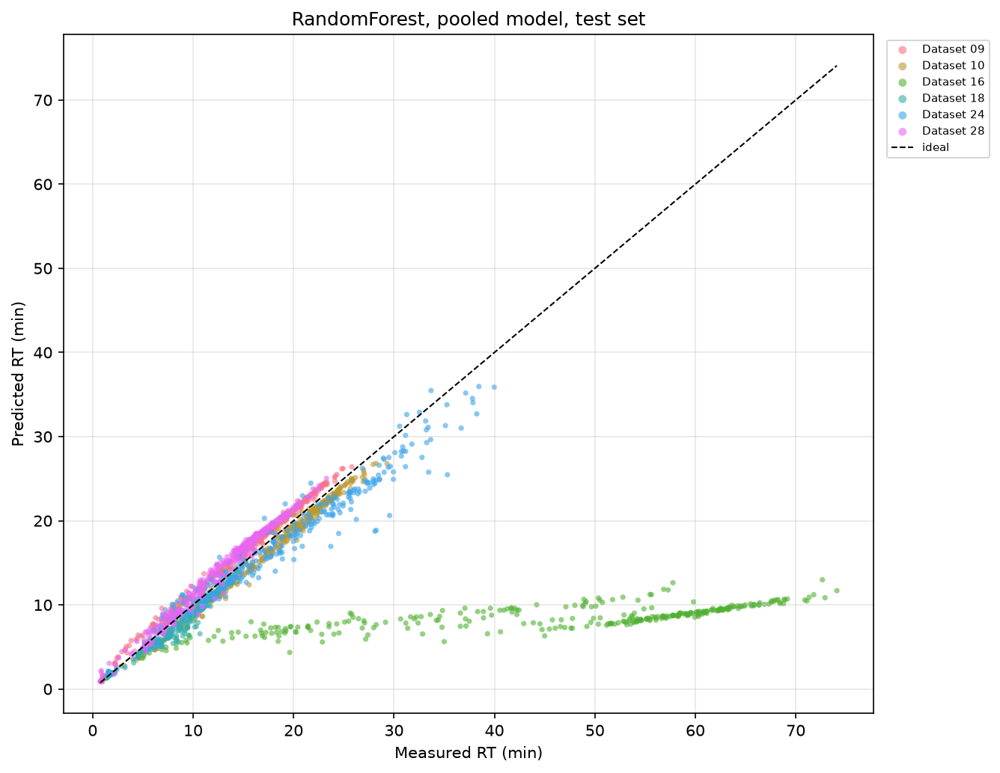

# Predicting HPLC retention time across variable chromatographic conditions

[](https://github.com/julianealdag/hplc-retention-prediction/actions/workflows/ci.yml)

Retention time in reversed-phase HPLC depends on the molecule and on the method
(solvent composition, gradient, column, temperature). A model trained on one
fixed method often fails when the conditions change. This project asks whether
one model can predict elution time across many methods.

The models are trained on 10,073 measured retention times from 30 reversed-phase
LC methods (343 compounds).

**Short answer: yes, within the range of the training methods.** For a
molecule the model has never seen, measured under one of the 30 training
methods, a pooled Random Forest predicts retention time with a mean absolute
error of **1.9 min** (R² = 0.91; a mean-predicting baseline is off by 7.7 min).
For held-out methods it reaches 0.9–1.7 min on five of six, but fails
completely on a method whose run is much longer than any in training. See
[Results](#results).

**Status:** you can train a model and predict retention times for new molecules
under any of the 30 MCMRT methods (see [Predicting retention
times](#predicting-retention-times)). Expect errors of about 2 minutes.

The pipeline is a rewrite of earlier coursework code. Five bugs found along
the way, including target leakage through the `RSD` column, are documented and
fixed in [`docs/corrections.md`](docs/corrections.md).

## Data

[MCMRT](https://doi.org/10.1038/s41597-024-03780-5) (Zhang *et al.*,
*Scientific Data* 2024): 343 small molecules measured under 30 reversed-phase
LC methods.

| | |
|---|---|
| Retention time measurements | 10,073 |
| Distinct molecules | 343 |
| Chromatographic methods | 30 |
| Compounds per method | 330–343 |
| Features, per-method model | 9 |
| Features, pooled model | 240 |

Not every molecule appears in every method.

## Features

**Molecular (RDKit, 2D):** molecular weight, LogP, TPSA, rotatable bonds,
H-bond donors and acceptors, aromatic rings, molar refractivity, Bertz
complexity. These cover size, lipophilicity, polarity, flexibility and shape.

**Method** (used only in the pooled model):

- Mobile phase: parsed from text such as `"Water:Methanol 90:10 + 0.1% formic acid"`
  into solvent indicators, volume ratios, and modifier/buffer concentrations.
- Gradient: variable-length (time, flow, %B) breakpoints, resampled onto a
  fixed 100-point grid (200 values). Interpolation is step-wise
  (`kind="previous"`), matching how the pump holds a setting until the next
  breakpoint.
- Instrument: column and sample temperature, dead time, and a one-hot encoding
  of the analytical column.

## Method

**Per-method models** (30): only the nine molecular descriptors. Conditions are
constant within one method, so they add no information. Question: how well does
structure alone predict retention for a fixed method?

**Pooled model:** descriptors plus method features, all 10,073 rows. Question:
can one model transfer across methods?

Regressors: Ridge, Lasso, Random Forest. Ridge and Lasso are used with
`StandardScaler` because the penalties are scale-sensitive and so that
coefficients can be compared. The forest is not scaled.

Hyperparameters are chosen with nested cross-validation (inner 5-fold for
tuning, outer 5-fold for scoring). A dummy regressor that predicts the training
mean is the baseline.

## Results

All numbers are from the corrected pipeline on the full MCMRT data, scored on a
held-out 20% test set that was not used for training or tuning. Every
configuration below can be reproduced with one `hplc-rt evaluate` command.

### Three ways of splitting the data

The pooled model is trained on all 30 methods together. How well it does
depends on what the test set is allowed to share with the training set:

- **Row-wise:** random measurements. A molecule in the test set has usually
  been seen in training under other methods.
- **Compound-held-out** (`--split-by compound`): whole molecules are held out.
  This is the realistic use case: a new compound on a known method.
- **Method-held-out** (`--split-by method`): whole methods are held out (6 of
  30). This tests transfer to unseen chromatographic conditions.

| Split | Random Forest | Ridge | Lasso | Mean baseline |
|---|---|---|---|---|
| Row-wise | **R² 0.966**, MAE 0.96 min | R² 0.773, MAE 3.28 | R² 0.773, MAE 3.27 | MAE 7.20 |
| Compound-held-out | **R² 0.906**, MAE 1.92 min | R² 0.730, MAE 3.76 | R² 0.677, MAE 4.31 | MAE 7.70 |
| Method-held-out | R² −0.18, MAE 7.00 min | **R² 0.487**, MAE 6.06 | R² 0.111, MAE 7.41 | MAE 10.19 |

Cross-validation on the training data agrees with the test scores for the first
two splits (Random Forest R² 0.955 ± 0.006 row-wise, 0.907 ± 0.011
compound-held-out). For the method split it varies between folds from R² 0.22
to 0.93, depending on which methods are held out.

The method-held-out score is an average over very different outcomes. Mean
absolute error of the Random Forest per held-out method:

| Held-out method | 18 | 10 | 09 | 28 | 24 | 16 |
|---|---|---|---|---|---|---|
| MAE (min) | 0.90 | 1.08 | 1.18 | 1.29 | 1.70 | **35.9** |



*Random Forest on six methods it was not trained on. Five lie on the diagonal.
Dataset 16 (green) runs up to 74 min, longer than any training method; its
predictions keep the right order but are squeezed into 7–13 min.*

**What this shows:**

- **Seeing a molecule before helps a lot.** Holding out whole molecules doubles
  the Random Forest error (0.96 → 1.92 min). The row-wise score is therefore
  optimistic for new compounds; the compound-held-out score is the one to quote.
- **Nonlinearity matters.** The forest beats both linear models clearly in
  the first two settings. LogP (lipophilicity) is the strongest single feature,
  as expected for reversed-phase separation.
- **Transfer to new methods works inside the training range.** On five of the
  six held-out methods the error (0.9–1.7 min) is as low as for new molecules
  on known methods.
- **It fails outside that range.** Dataset 16 (median 52 min, up to 74 min)
  runs far longer than every training method (medians ≤ 25 min). A Random
  Forest cannot predict beyond the values it was trained on, so it misses that
  method by 36 min on average, which turns the overall R² negative. Ridge
  extrapolates somewhat and degrades less. Because the predicted order is still
  right, predicting a normalised quantity (relative to the run length or dead
  time) instead of raw minutes is the obvious next step.

### One model per method

Each of the 30 per-method models sees only the nine molecular descriptors.
Mean over the 30 test sets:

| Model | R² | MAE (min) |
|---|---|---|
| **Random Forest** | **0.795** | **1.92** |
| Lasso | 0.702 | 2.48 |
| Ridge | 0.691 | 2.49 |
| Mean baseline | 0.00 | 4.93 |

Within one method each molecule appears once, so a compound-held-out split
changes little here (Random Forest R² 0.815). The per-method Random Forest
ranges from R² 0.71 (Dataset 19) to 0.85 (Dataset 16).

A pooled model on known methods (R² 0.966 row-wise) beats a separate model per
method (0.795): learning from all methods together helps, as long as the method
was in the training data.

### Effect of the `RSD` leak

`RSD` (replicate scatter, only known after measuring) was a predictor in the
original coursework code. Restoring it to the pooled Random Forest:

| Pooled Random Forest, row-wise | R² | MAE (min) |
|---|---|---|
| Corrected (no `RSD`) | 0.966 | 0.96 |
| With `RSD`, as in the original code | 0.962 | 1.09 |
| With `RSD` and the retention factor *k* | 0.9996 | 0.08 |

`RSD` did not inflate the score; it added noise. It was still a methodological
error, since it cannot be known before a compound has been measured. The
retention factor *k*, which together with the dead time gives the retention
time exactly, would have made the model almost perfect; the original code
already excluded it.

## Limitations

**Predictions only for the training methods.** `hplc-rt predict` supports the
30 MCMRT methods. Evaluation shows transfer to new methods of similar run
length, but a method with a much longer run (like Dataset 16) is outside what
the model can extrapolate to, and the tool cannot yet describe a new method.

**Row-wise split is the default.** It overstates how well the model handles new
molecules. Use `--split-by compound` for the realistic estimate.

**One random method split.** The method-held-out score comes from a single
split of 6 test methods and depends strongly on which methods those are. A
leave-one-method-out evaluation would be more reliable.

**Column chemistry** is only a one-hot identity, so the model cannot generalise
to columns that were not in the training data.

**Descriptors are 2D.** Shape and conformation are not represented.

**Thirty reversed-phase methods.** All are reversed-phase, so they may be more
similar than the count implies.

## Getting the data

The dataset is not included in the repository. Download it with:

```bash
python scripts/download_data.py
```

This fetches the 30 `.xlsx` files from
[Science Data Bank](https://doi.org/10.57760/sciencedb.15823) into `data/raw/`
and checks each file's MD5 checksum. If the script stops working, download the
files by hand from that page and put them in `data/raw/`.

The data are CC0 (public domain). If you use them, cite:

> Zhang, Y., Liu, F., Li, X.Q., Gao, Y., Li, K.C., Zhang, Q.H. Retention time
> dataset for heterogeneous molecules in reversed-phase liquid chromatography.
> *Scientific Data* **11**, 946 (2024). https://doi.org/10.1038/s41597-024-03780-5

Each file has an `RT` sheet and an `LC setups` sheet (metadata, then a
`Gradient elution program` marker, then the gradient table).

Without the real files:

```bash
python scripts/make_synthetic_data.py --out data/synthetic --n-experiments 3
hplc-rt evaluate --data-dir data/synthetic
```

Synthetic retention times are a function of LogP used to test the code, not
real measurements.

## Install and run

```bash
git clone https://github.com/julianealdag/hplc-retention-prediction.git
cd hplc-retention-prediction
pip install -e .
```

Python 3.10+.

### Evaluating models

```bash
# 30 per-method models plus the pooled model, 3 regressors each
hplc-rt evaluate --data-dir data/raw --output results/

# pooled model only
hplc-rt evaluate --data-dir data/raw --pooled-only

# one regressor
hplc-rt evaluate --data-dir data/raw --models RandomForest

# hold out entire molecules
hplc-rt evaluate --data-dir data/raw --split-by compound --pooled-only

# hold out entire methods (pooled model only)
hplc-rt evaluate --data-dir data/raw --split-by method
```

`hplc-rt` without a subcommand runs `evaluate`, so older commands still work.

```python
from hplc_rt import pipeline

output = pipeline.run(data_dir="data/raw")
print(output.test_summary)
```

Each run writes `cv_summary.csv`, `test_summary.csv`, `fold_scores.csv` (every
outer CV fold, with the methods it held out) and `predictions.csv` (measured
and predicted retention time for every test row), plus figures. The pooled
Random Forest grid search dominates the run time: about 8 minutes per split on
a laptop.

### Predicting retention times

Train the pooled model on all the data once and save it:

```bash
hplc-rt train --data-dir data/raw --out model.joblib
```

Then predict for any molecule given as SMILES, under one or more of the
training methods:

```bash
hplc-rt predict --model model.joblib --list-methods
hplc-rt predict --model model.joblib --smiles "CC(=O)Oc1ccccc1C(=O)O" --method <method>
hplc-rt predict --model model.joblib --input molecules.csv --output predictions.csv
```

`--input` reads a CSV with a `SMILES` column (`--smiles-column` changes the
name). Without `--method`, every method in the model is predicted. The `Note`
column flags:

- `invalid SMILES`: no prediction is made.
- `outside training range: ...`: a descriptor lies outside the range of the
  343 training compounds. Random Forest does not extrapolate, so these
  predictions are unreliable.
- `measured in training data`: this molecule was measured under this method,
  so the measured value in MCMRT is better than the prediction.

```python
from hplc_rt.predictor import TrainedModel

model = TrainedModel.load("model.joblib")
print(model.predict(["CCO", "c1ccccc1"], methods=model.methods[:2]))
```

Predictions are only possible for the 30 MCMRT methods. A new method or column
cannot be described to the model yet. Model files are Python pickles, so only
load ones you trust.

### Tracking runs with Weights & Biases (optional)

```bash
pip install -e ".[wandb]"
wandb login                     # once; stores your API key
hplc-rt evaluate --data-dir data/raw --split-by compound --pooled-only --wandb
hplc-rt train --data-dir data/raw --out model.joblib --wandb
```

`evaluate` logs the settings, package version and git commit, the CV and test
tables, the score of every CV fold, headline metrics (pooled scores per model
and the mean over the per-method models), the figures, and an interactive
predicted-vs-measured scatter per pooled model. `train` also uploads the model file as a
versioned artifact. `--wandb-project` changes the project name (default
`hplc-retention-prediction`).

Results from runs made without `--wandb` can be uploaded afterwards:

```bash
python scripts/log_results_to_wandb.py results/pooled_compound --split-by compound
python scripts/log_results_to_wandb.py --model model.joblib
```

### Tests

```bash
pip install -e ".[dev]"
pytest          # 67 tests, synthetic data
```

Some tests check that the issues in
[`docs/corrections.md`](docs/corrections.md) do not return.

```bash
python scripts/quantify_leakage.py --data-dir data/raw --columns RSD
```

## Layout

```
src/hplc_rt/          pipeline, training and prediction, CLI
scripts/              data download, synthetic data, leakage comparison, W&B upload
tests/                pytest suite
docs/                 corrections to the original coursework code
data/                 download instructions (raw files are gitignored)
```

## About this repository

This project started as a group coursework project for **Digital Chemistry
(FS2025) at ETH Zürich** in June 2025. I have continued it on my own since then.
The code in this repository is that later work: the installable package, the
corrected pipeline, the tests, the command-line interface and
[`docs/corrections.md`](docs/corrections.md).

## Feedback

If you use this, find a bug, or have ideas or data that could improve it, please
[open an issue](https://github.com/julianealdag/hplc-retention-prediction/issues).
I am happy to discuss.

## Acknowledgements

The package, tests and documentation were developed with the help of [Claude Code](https://claude.com/claude-code) (Anthropic) as an agentic coding assistant.

## References

1. Zhang, Y., Liu, F., Li, X.Q., Gao, Y., Li, K.C. & Zhang, Q.H. Retention time
   dataset for heterogeneous molecules in reversed-phase liquid chromatography.
   *Scientific Data* **11**, 946 (2024).
   [doi:10.1038/s41597-024-03780-5](https://doi.org/10.1038/s41597-024-03780-5)
2. Landrum, G. *et al.* RDKit: Open-source cheminformatics toolkit.
   [rdkit.org](https://www.rdkit.org/)
3. Pedregosa, F. *et al.* Scikit-learn: Machine learning in Python. *JMLR* **12**,
   2825–2830 (2011).

## License

MIT, see [LICENSE](LICENSE). The MCMRT dataset is CC0 (public domain); please
cite its authors (reference 1).
